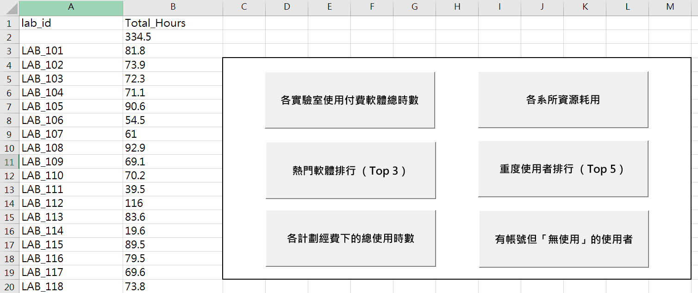

# For-NCU-MIS

一鍵產出付費軟體使用時數統計報表  

Demo影片：[Demo]([https://www.runoob.com](https://www.youtube.com/watch?v=J0tBl-VmcOc))
---
# 準備工作
1. 將 labs.csv, students.csv, usage.csv 三個檔案放在同一個資料夾下。  
2. 開啟一個新的 Excel 活頁簿，按下 Alt + F11 進入 VBA 編輯器。  
3. 點選選單 [工具] (Tools) -> [引用項目] (References)。  
4. 勾選 Microsoft ActiveX Data Objects 6.1 Library (若沒有 6.1，選 2.8 或最新版本即可)。  

#### 可能出現問題
- 存檔格式：這份 Excel 檔案必須存成 「Excel 啟用巨集的活頁簿 (.xlsm)」，否則按鈕跟程式碼在下次開啟時會消失。
- 安全性提示：第一次執行時，Excel 可能會出現「安全性警告 - 已停用巨集」，請點擊 「啟用內容」 即可。

---
# 程式碼（scripts）介紹
1. Funding.bas：各計劃經費下的總使用時數
2. LAB_total_time.bas：各實驗室使用付費軟體總時數
3. Top_software.bas：熱門軟體排行（Top3）
4. Top_student.bas：重度使用者排行（Top5）
5. Warning.bas：有帳號但「無使用」的使用者
6. department.bas：各系所資源耗用

---
# 測試檔案（test_dataset）介紹
1. labs：實驗室經費代碼
2. students：學生資料
3. usage：軟體使用紀錄
註：學校系統下載之檔案與測試檔案類似
